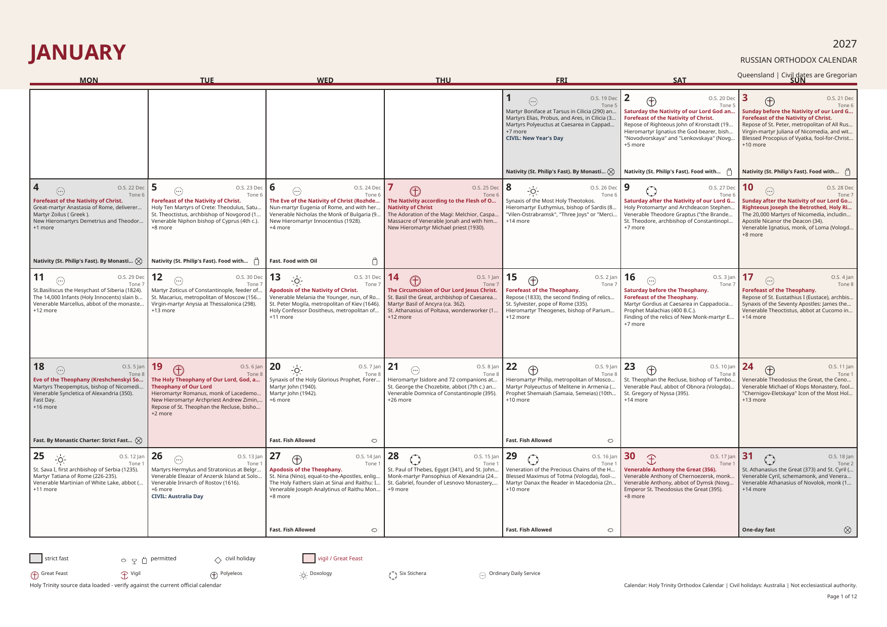

# Russian Orthodox Calendar Generator

A Windows desktop application for producing print-ready Russian Orthodox calendars in English or Russian, with Australian public holidays kept separate from liturgical observances.



## Highlights

- Twelve-page A4 landscape PDF by default, with optional portrait output.
- Original English and Russian Holy Trinity source content; Russian liturgical text is not machine-translated.
- Gregorian civil dates and Julian church dates.
- Source-derived Typikon service ranks: Great Feast, Vigil, Polyeleos, Doxology, Six Stichera and No Sign.
- Distinct, bundled service-rank and fasting-permission icons that remain available offline.
- Great Feast/Vigil pink washes, strict-fast grey washes and restrained print-friendly styling.
- Select, deselect, search and reorder saints before publication.
- Australian state and territory public holidays using `python-holidays`.
- SQLite provenance, bilingual source records, cache-first synchronization and user overrides.
- Standalone Windows distribution: end users do not need Python or the legacy .NET application.

## Install the Windows release

1. Open the repository's **Releases** page.
2. Download `RussianOrthodoxCalendar-1.3.0-windows-x64.zip`.
3. Extract the complete archive.
4. Run `RussianOrthodoxCalendar.exe`.

Keep the EXE and its `_internal` directory together. Writable data is stored under `%LOCALAPPDATA%\RussianOrthodoxCalendar`.

## Run from source

Python 3.12 or 3.13 is recommended.

```powershell
py -3.13 -m venv .venv
.\.venv\Scripts\python.exe -m pip install -r requirements-dev.txt
.\.venv\Scripts\python.exe app.py
```

Useful command-line operations:

```powershell
# Synchronize the bilingual source
.\.venv\Scripts\python.exe app.py --sync-holy-trinity --year 2027

# Generate English and Russian calendars
.\.venv\Scripts\python.exe app.py --generate-pdf --year 2027 --state QLD --language English
.\.venv\Scripts\python.exe app.py --generate-pdf --year 2027 --state QLD --language Russian

# Use only previously downloaded source pages
.\.venv\Scripts\python.exe app.py --sync-holy-trinity --year 2027 --cache-only
```

## Authoritative source handling

The **Update Data** action uses the English and Russian Holy Trinity Orthodox Calendar endpoints previously used by the legacy application:

- English: `https://www.holytrinityorthodox.com/htc/ocalendar/v2calendar.php`
- Russian: `https://www.holytrinityorthodox.com/htc/ocalendar/ru/v2calendar.php`

Typikon signs are normalized according to Holy Trinity's published [English](https://www.holytrinityorthodox.com/htc/ocalendar/TipikonSigns.htm) and [Russian](https://www.holytrinityorthodox.com/htc/ocalendar/ru/TipikonSigns.htm) keys. Original rank code/text, source URL and normalized classification are retained. Missing and unknown classifications are not silently converted to No Sign.

The synchronizer is user-initiated, cache-first and conservatively rate-limited. Failed updates preserve existing data. Calendar content should still be verified against the current official calendar used by the relevant parish or diocese; this application is a publishing tool, not an ecclesiastical authority.

## Build and verify

```powershell
.\build_exe.ps1
```

The build script runs the tests, creates the PyInstaller onedir distribution, generates a complete PDF through the compiled EXE and validates its page count, A4 dimensions and extractable text.

Primary output:

```text
dist\RussianOrthodoxCalendar\RussianOrthodoxCalendar.exe
```

## Tests

```powershell
.\.venv\Scripts\python.exe -m pytest
```

The suite covers calendar mathematics, Pascha and movable feasts, fasting, all Australian jurisdictions, bilingual source parsing, service-rank normalization and hierarchy, unknown/no-data handling, provenance and overrides, editor selection states, icon embedding, Cyrillic output and annual PDF validation.

## Data scope

- Australian holidays are civil-calendar information and never liturgical feasts.
- Source synchronization and imported data retain provenance.
- No automatic translation service is used for authoritative Russian content.
- The application does not require the old legacy .NET executable or its files.
